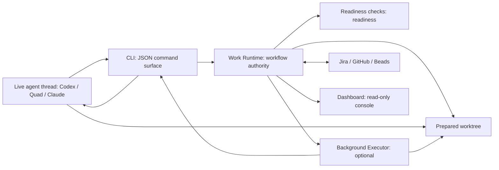

# Flow Runtime And Dashboard

Flow is optional local workflow infrastructure for FARMserver
agent-assisted work. It is not part of the FARMserver application runtime and is
not required for manual development.

Use it when an operator-facing agent needs durable workflow coordination across
Jira, Git, GitHub, local worktrees, executor attempts, acceptance evidence, and PR
handoff. Skip it for ordinary manual edits, component build/test loops, or
explicit direct-tooling recovery.

## Runtime Roles

The active local stack has two long-running roles plus the CLI:

- **Readiness checks** evaluates Work Runtime-reconciled state and returns blockers or
  readiness.
- **Work Runtime** is the workflow authority. It reconciles Jira, Git/worktree,
  GitHub, Executor output, and Beads before deciding the next valid action.
- **CLI** is the operator surface used by Codex, Claude, Quad, and other agents.
  It emits stable JSON and persists Work Runtime sessions.
- **Dashboard** is the browser operator console. It presents Work Runtime state
  as a read-only projection.

Executors are assigned per issue. An executor may be the current live agent thread
adopted by Work Runtime, or a bounded background agent launched for a
narrow task. Executors are not long-running services.

The live agent thread is the normal interactive work surface for complex sprint
issues. One live thread can coordinate multiple Jira efforts, but each effort
keeps separate Flow state: issue, routed repos, worktrees, evidence, PR
state, blockers, and closeout. Chat history is not the workflow ledger.

## Communication Protocol

Operator-facing agents talk to the CLI for workflow actions. The CLI is the
protocol boundary that turns JSON command input into Work Runtime-owned workflow
calls. This keeps Jira/GitHub/Beads/native Flow writes, readiness gates, evidence, PR
handoff, approval closeout, and post-merge Jira verification in one authority path.



Dashboard is a separate read-only operator console over Work Runtime state. It
does not author work envelopes, orchestrate execution, or act as a workflow
authority.

## Start Commands

From the Flow repo:

```bash
npm run start:all
npm run start:all:watch
npm run flow
npm run dashboard
```

From the repo root:

```bash
flow commands
flow queue
flow select FSB-123 --session codex-fsb-123
flow advance FSB-123 --session codex-fsb-123
flow-dashboard
```

`npm run start:all` starts Work Runtime and Dashboard
together. It also builds the runtime and dashboard first.

You do not need to launch a Flow server for CLI workflow. The CLI loads Work
Runtime directly and exits after emitting JSON. Launch the dashboard server only
when you want the browser operator console.

`npm run start:all:watch` wraps `start:all` with Node watch mode for `src/` and
`flow/`. Use it while editing Flow runtime code so file changes rebuild
and restart the local stack automatically.

`start:all` prints the dashboard URL but does not open a browser by default. Set
`FLOW_OPEN_DASHBOARD=1` when you want startup to open the dashboard.

Use `--session <id>` to persist CLI sessions under
`.context/flow/flow-runtime/sessions/`.

## Endpoints

Dashboard:

- UI: `http://127.0.0.1:8767/dashboard`
- API: `http://127.0.0.1:8767/api/dashboard`
- Health: `http://127.0.0.1:8767/healthz`

Work Runtime and Readiness checks are internal role servers used by CLI and
projected by Dashboard.

## Dashboard Refresh Semantics

The dashboard serves live Work Runtime state. It does not cache queue data or
serve stale snapshots.

- Browser poll interval: 5 seconds
- Every `/api/dashboard` request performs a Work Runtime queue inspection
- Manual Refresh performs the same live read immediately
- Live refresh timeout: `FLOW_DASHBOARD_LIVE_REFRESH_TIMEOUT_MS`, default 60 seconds

## Flow Ledger

Work Runtime writes to the native Flow JSONL workflow ledger by default:
`.context/flow/workflow.jsonl`. Set `FLOW_WORKFLOW_LEDGER_PATH` to use a
different local ledger file.

Set `FLOW_LEDGER_ADAPTER=beads` only when intentionally running the legacy
FARMserver Beads adapter.

The API includes snapshot freshness:

```json
{
  "snapshot": {
    "source": "work_runtime",
    "refreshedAt": "2026-05-13T20:43:18.114Z",
    "ageSeconds": 0,
    "stale": false
  },
  "stale": false,
  "refreshing": false,
  "degraded": false
}
```

The API does not return stale issue data. If Work Runtime is unavailable or
times out, it returns `degraded=true` with the error and an empty issue list.

## Authority Boundary

Dashboard must not write Jira, GitHub, Beads, branch state, PR state, work
envelopes, or executor orchestration directly. Work Runtime owns workflow
mutation and reconciliation.

If Dashboard and Flow disagree, use the Flow or Work Runtime to reconcile the
issue, then refresh Dashboard. Do not treat Dashboard card text as more
authoritative than Work Runtime, Readiness checks, Jira, GitHub, or the prepared
worktree.

## Validation

Run the focused Flow checks from the Flow repo:

```bash
npm run build
npm run check
npm test
npm run smoke:dashboard
```

For dashboard-only changes, `npm run build` and `npm run smoke:dashboard` are
the minimum useful checks.
