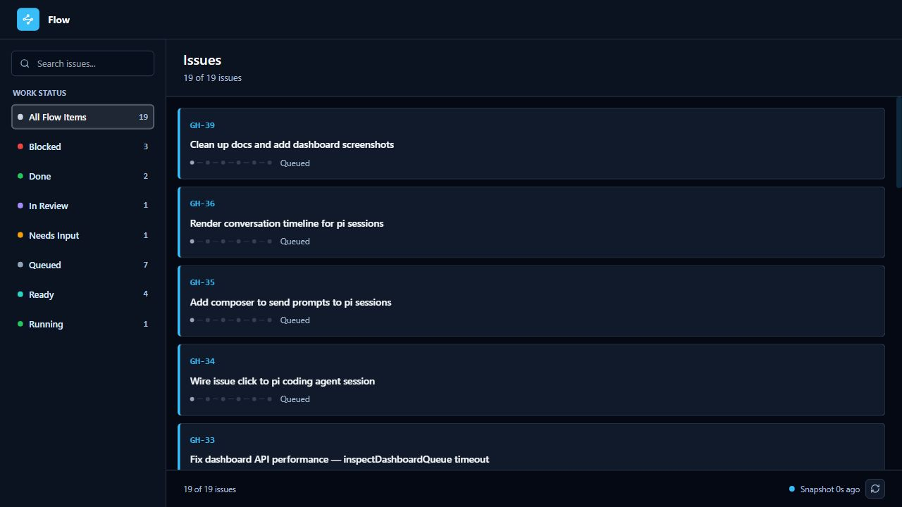
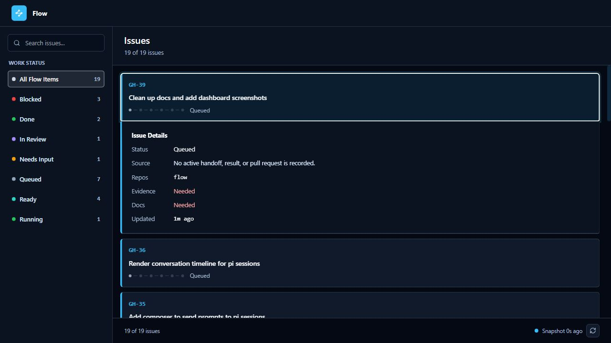

# Runtime And Dashboard

Flow has two surfaces:

- `flow`: JSON protocol for agents and adapters.
- `flow-dashboard`: read-only human mirror.

The dashboard reads Flow state through `/api/dashboard`. It does not expose
workflow command routes, action endpoints, or agent orchestration controls.
Dashboard reloads only re-read that state snapshot.

## Dashboard

```bash
npx flow-dashboard
```

Default endpoints:

- `http://127.0.0.1:8767/dashboard`
- `http://127.0.0.1:8767/api/dashboard`
- `http://127.0.0.1:8767/healthz`

Dashboard presentation is built in. It does not load project custom CSS or
expose theme controls.



The dashboard shows:

- issue refs and titles
- work status counts
- blockers and review state
- evidence and docs status
- repo routing
- handoff prompt text when one is recorded
- snapshot freshness

It can filter by work status, search visible issues, refresh the snapshot, and
copy handoff text. These controls only change the local view or clipboard. They
do not mutate Flow state.



## State Source

The dashboard is a mirror over Flow's ledger and runtime projection:

```text
.flow/config.yaml
.flow/ledger/workflow.jsonl
.flow/ledger/issues/
.flow/runtime/
```

For Flow itself, the ledger is committed so the project can dogfood shared
workflow history. Runtime stays local because it is machine and session state.

Consumer repos can choose whether ledger history belongs in Git. Runtime should
stay local.

## Read-Only Boundary

The dashboard only serves `GET` and `HEAD` routes. Non-read methods return
`404`.

Important routes:

- `/dashboard`: browser UI
- `/api/dashboard`: JSON snapshot used by the browser UI
- `/healthz`: server health

Mutations go through the `flow` JSON protocol, not the dashboard.

## Agent Protocol

```bash
flow --help
flow '{"op":"queue"}'
flow '{"op":"manifest","target":"workflow"}'
flow '{"op":"workflow","mode":"recordResult","id":"FLOW-123","repoKey":"main","summary":"Patch applied","testsRun":["npm test"]}'
```

Work-item requests use `id` as the public identifier.

Stdout is always one JSON document.

## Handoff Prompts

When work cannot continue in the current thread, Flow records a handoff prompt.
It does not launch or supervise another agent. The prompt is the pickup note for
the next local thread, and the result is recorded back through `flow`.

## Verification

Use these checks when changing the dashboard or its docs:

```bash
npm run check
npm test
npm run build
npm run smoke:dashboard
```
