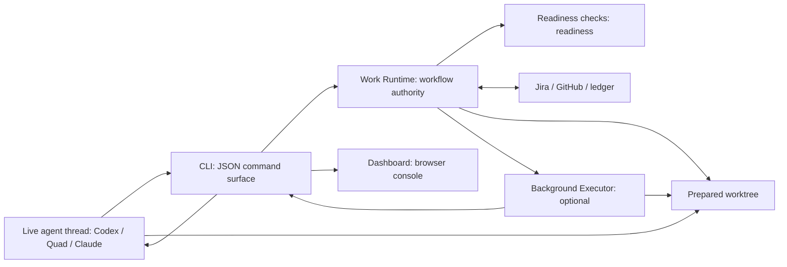

# Flow Runtime And Dashboard

Flow is optional local workflow infrastructure for repo-hosted
agent-assisted work. It is not part of any product application runtime and is not
required for manual development.

Use it when an operator-facing agent needs durable workflow coordination across
Jira, Git, GitHub, local worktrees, executor attempts, acceptance evidence, and PR
handoff. Skip it for ordinary manual edits, component build/test loops, or
explicit direct-tooling recovery.

## Runtime Roles

The active local stack has one long-running role plus the CLI:

- **Readiness checks** evaluates Work Runtime-reconciled state and returns blockers or
  readiness.
- **Work Runtime** is the workflow authority. It reconciles Jira, Git/worktree,
  GitHub, Executor output, and ledger state before deciding the next valid
  action.
- **CLI** is the operator surface used by Codex, Claude, Quad, and other agents.
  It emits stable JSON and persists Work Runtime sessions.
- **Dashboard** is the browser operator console. It presents CLI-reconciled Flow
  state and routes any dashboard actions back through `flow call`.

Executors are assigned per issue. An executor may be the current live agent thread
adopted by Work Runtime, or a bounded background agent launched for a
narrow task. Executors are not long-running services.

The live agent thread is the normal interactive work surface for complex sprint
issues. One live thread can coordinate multiple Jira efforts, but each effort
keeps separate Flow state: issue, routed repos, worktrees, evidence, PR
state, blockers, and closeout. Chat history is not the workflow ledger.

## Communication Protocol

Operator-facing agents talk to the CLI for workflow actions. The CLI is the
protocol boundary that turns JSON command input into Work Runtime-owned workflow
calls. This keeps Jira/GitHub/ledger/native Flow writes, readiness gates, evidence, PR
handoff, approval closeout, and post-merge Jira verification in one authority path.



Dashboard is a separate operator console over CLI-reconciled state. It does not
own Jira, GitHub, ledger, branch, PR, work envelope, or executor decisions.

## Start Commands

From the Flow repo:

```bash
npm run start:all
npm run start:all:watch
npm run flow
npm run dashboard
```

From the repo root:

```bash
flow commands
flow queue
flow create-issue --type Bug --summary "Fix provider parquet schema" --description "Follow-up from ISSUE-15461." --repo app_api
flow select ISSUE-123 --session codex-issue-123
flow advance ISSUE-123 --session codex-issue-123
flow-dashboard
```

`flow commands` is the CLI discovery command. It returns JSON containing command
descriptions, examples, and the raw Work Runtime methods supported by
`flow call`, including `createIssue`, `bootstrapJiraIssue`, `routeIssue`, and
`advanceIssue`. Provider-specific method names remain only as compatibility
aliases where existing agents already use them.

`npm run start:all` starts the Dashboard. It also builds the runtime and
dashboard first.

You do not need to launch a Flow server for workflow. The CLI loads Work Runtime
directly and exits after emitting JSON. Launch the dashboard server only when you
want the browser operator console.

`npm run start:all:watch` wraps `start:all` with Node watch mode for `src/` and
`flow/`. Use it while editing Flow runtime code so file changes rebuild
and restart the local stack automatically.

`start:all` prints the dashboard URL but does not open a browser by default. Set
`FLOW_OPEN_DASHBOARD=1` when you want startup to open the dashboard.

Use `--session <id>` to persist CLI sessions under
`.context/flow/flow-runtime/sessions/`.

## Endpoints

Dashboard:

- UI: `http://127.0.0.1:8767/dashboard`
- API: `http://127.0.0.1:8767/api/dashboard`
- Health: `http://127.0.0.1:8767/healthz`

Work Runtime is an in-process library used by the CLI. Dashboard actions route
through the same CLI path instead of a separate Work Runtime API.

## Dashboard Refresh Semantics

The dashboard serves live CLI-reconciled Flow state. It does not cache queue data or
serve stale snapshots.

- Browser poll interval: 5 seconds
- Every `/api/dashboard` request performs a `flow call inspectDashboardQueue`
  inspection
- Manual Refresh performs the same live read immediately
- Live refresh timeout: `FLOW_DASHBOARD_LIVE_REFRESH_TIMEOUT_MS`, default 60 seconds

## Flow Ledger

Work Runtime writes to the native Flow JSONL workflow ledger by default:
`.context/flow/workflow.jsonl`. Set `FLOW_WORKFLOW_LEDGER_PATH` to use a
different local ledger file.

Set `FLOW_LEDGER_ADAPTER=beads` only when intentionally running the legacy
Beads adapter.

The dashboard API includes snapshot freshness:

```json
{
  "snapshot": {
    "source": "flow_cli",
    "refreshedAt": "2026-05-13T20:43:18.114Z",
    "ageSeconds": 0,
    "stale": false
  },
  "stale": false,
  "refreshing": false,
  "degraded": false
}
```

The dashboard API does not return stale issue data. If the Flow CLI is unavailable
or times out, it returns `degraded=true` with the error and an empty issue list.

## Authority Boundary

Dashboard must not write Jira, GitHub, ledger, branch state, PR state, work
envelopes, or executor orchestration directly. The Flow CLI is the only blessed
workflow write/control surface; Work Runtime remains the in-process library
behind it.

If Dashboard and Flow disagree, use the Flow CLI to reconcile the
issue, then refresh Dashboard. Do not treat Dashboard card text as more
authoritative than CLI output, Readiness checks, Jira, GitHub, or the prepared
worktree.

## Validation

Run the focused Flow checks from the Flow repo:

```bash
npm run build
npm run check
npm test
npm run smoke:dashboard
```

For dashboard-only changes, `npm run build` and `npm run smoke:dashboard` are
the minimum useful checks.
